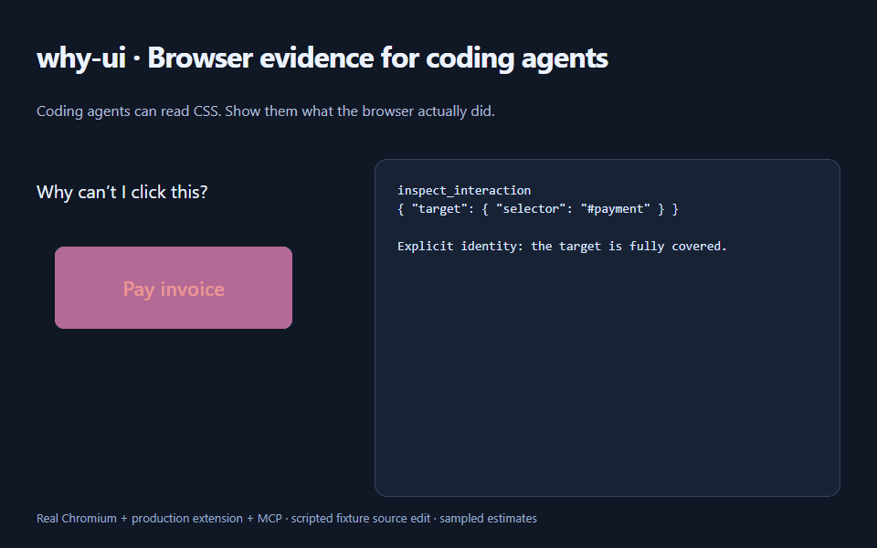
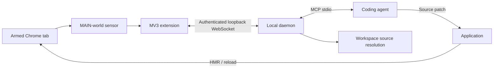

# why-ui

Coding agents can read CSS. **why-ui lets them inspect what the browser actually did.**

Find the element covering a button, trace it toward local source, and independently
verify the fix after the agent edits code.

[](docs/demo.md)

*Actual Chromium + production extension + MCP. Scripted fixture source edit.
100% sampled blockage → 0%. [Evidence and reproduction](docs/demo.md).*

[CI](https://github.com/Yudis-bit/why-ui/actions/workflows/ci.yml) ·
[Release](https://github.com/Yudis-bit/why-ui/releases/latest) ·
[Framework checks](docs/framework-validation.md) · [Security](docs/security.md)

## Quick start

Requires **Node 22.13+** and desktop **Chrome 116+** with unpacked extensions allowed.
CI uses Chromium 153, Linux/Node 22, and Windows/Node 24.

1. Download the [extension ZIP](https://github.com/Yudis-bit/why-ui/releases/download/v0.1.0/why-ui-extension-v0.1.0.zip).
   Extract it into a stable directory. In `chrome://extensions`, enable **Developer mode**,
   select **Load unpacked**, and choose that directory. Pin the why-ui action.
2. Install the GitHub release and pair:

   ```sh
   npm install -g https://github.com/Yudis-bit/why-ui/releases/download/v0.1.0/why-ui-0.1.0.tgz
   why-ui pair
   ```

   Open extension **Options** and enter the displayed one-time token and port.
3. Configure your agent's MCP connection below. Open your application in Chrome, select
   the why-ui action or press **Alt+Shift+Y**, then move the pointer over the interaction.

`why-ui doctor --workspace /path/to/app` checks the local installation and prints an
absolute-path MCP configuration, including for Windows. It never prints credentials.
TCP reachability alone does not prove a connected extension or armed tab.

Downloads include `SHA256SUMS.txt`. Distribution is GitHub-first; no npm-registry
publication is claimed. Prefer source builds? [Instructions below](#build-from-source).

## Claude Code / Cursor

For Claude Code, run from the application repository:

```sh
claude mcp add --transport stdio --scope local why-ui -- why-ui mcp --workspace /path/to/app
```

Use `/mcp` to check the connection. If your agent cannot resolve the global command
(particularly a Windows npm shim), use the absolute Node command printed by `why-ui doctor`.

For Cursor, put this in the application's `.cursor/mcp.json`. Replace the paths with
those printed by `why-ui doctor --workspace /path/to/app --json` under `mcpServer`:

```json
{
  "mcpServers": {
    "why-ui": {
      "command": "node",
      "args": ["/path/to/why-ui/bin/why-ui.js", "mcp", "--workspace", "/path/to/app"]
    }
  }
}
```

[Claude Code configuration](https://code.claude.com/docs/en/mcp) ·
[Cursor configuration](https://cursor.com/docs/mcp).
Client formats are documented; automated transport tests use the official MCP SDK.
One daemon, one agent connection, and one armed tab are supported at a time.

## Inspect → patch → verify

Call `inspect_interaction` with `{}` after pointing at a reachable part of the target.
A fully covered or pointer-transparent target needs a known identity:

```json
{ "target": { "selector": "#payment" }, "maxSamples": 64 }
```

The tool returns a concise human-readable summary and structured evidence: target,
primary blocker, sampled surface, diagnosis, stacking explanation, local source
references with explicit certainty, limitations, and an `inspectionId`.

After the agent edits source and the application updates:

```json
{ "inspectionId": "<returned inspectionId>", "stabilizationTimeoutMs": 10000 }
```

Call this with `verify_fix`:

- **VERIFIED_PASS**: identity reconciles, source/runtime changed, fresh geometry and hits
  stabilize, the diagnosed failure is absent, and a meaningful Safe Core exists.
- **VERIFIED_FAIL**: fresh browser evidence still proves a failure, including a new blocker.
- **VERIFY_INCONCLUSIVE**: identity, readiness, or safe-region evidence is insufficient.

why-ui does not edit code or activate controls. Reflow is normal: old geometry does not
establish the result. [Verification semantics and thresholds](docs/verification.md).

## How it works



Browser hits establish interaction truth. why-ui explains relevant stacking contexts
and maps bounded runtime hints toward local files. The agent reasons about the patch;
why-ui independently reruns runtime assertions. [Architecture](docs/architecture.md).

## Security and limits

Loopback `127.0.0.1` only. Single-use pairing binds an extension Origin and a 32-byte
secret; sessions use HMAC challenge-response. Auth lives in `~/.why-ui/auth.json`, mode
`0600` where supported. Human logs use stderr; MCP stdout is protocol only.

No cookies, page-storage values, input/textarea contents, full HTML/DOM, screenshots,
network bodies, or Fiber props/state are collected during inspection. Bounded labels,
IDs, classes, keys and source paths remain evidence visible to the agent.
[Threat model](docs/security.md) · [Private vulnerability reporting](SECURITY.md).

React is optional. Tested development setups include Vite/React 18 and Next App Router /
Turbopack / React 19 native HMR. [Exact versions and limitations](docs/framework-validation.md).
Closed shadow interiors and iframe contents remain opaque. Missing maps become UNMAPPED;
static correlations are heuristic. Source-map fetching stays on the app's same loopback
origin. Ratios and Safe Core are estimates; handler correctness, keyboard behavior and
exact geometric coverage are not proved.

If pairing expires, restart `why-ui pair`. For lost pairing, stop the MCP process, run
`why-ui pair --reset`, choose **Forget pairing** in Options, and pair again. Default port
is 9876; set `--port` and the Options port together if occupied. Re-arm after cross-origin
navigation. Keep the unpacked extension path stable.

## Build from source

```sh
git clone https://github.com/Yudis-bit/why-ui.git
cd why-ui
npm ci
npm run build
node bin/why-ui.js pair
```

Load `dist/extension/` unpacked and configure the agent to run `node` with this checkout's
absolute `bin/why-ui.js` path. `npm link` optionally installs the `why-ui` command.

## Development

```sh
npx playwright install --with-deps chromium
npm run typecheck
npm test
npm run test:browser
npm run test:e2e
npm run test:dogfood
npm run test:package
npm run build:extension
```

[Contributing](CONTRIBUTING.md) · [Browser validation](docs/browser-validation.md) ·
[Bridge protocol](docs/bridge-protocol.md) · [Share a UI bug](https://github.com/Yudis-bit/why-ui/discussions).
Licensed under [MIT](LICENSE).
