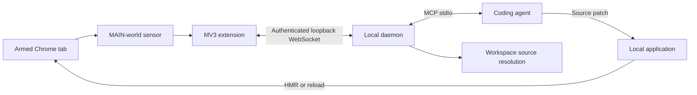

# why-ui

Runtime evidence for coding agents.

Your coding agent can read CSS. why-ui lets it inspect what the browser actually did.

A payment button is covered by a modal backdrop. `inspect_interaction` reports the
browser's blocking element, sampled reachability, stacking contexts, and local source
references where available. The agent changes the code. `verify_fix` reacquires the
button after the runtime updates and independently returns PASS, FAIL, or INCONCLUSIVE.



## Build and connect

Requires Node.js **22.13+**, npm, and desktop Chrome **116+** with unpacked extensions
allowed. Validation uses Chromium 153 and React 18.3.1 / 19.2.8. React is optional.

Clone and build:

```sh
git clone https://github.com/Yudis-bit/why-ui.git
cd why-ui
npm ci
npm run build
```

1. Open `chrome://extensions`, enable **Developer mode**, choose **Load unpacked**, and
   select this repository's `dist/extension/` directory. Pin the why-ui action.
2. Run `node bin/why-ui.js pair`. In the extension's **Options**, enter the displayed
   one-time token and port. The pairing command exits after authentication.
3. Configure your coding agent to launch the MCP command below. Start your application
   normally, open its Chrome tab, and select the why-ui action or press **Alt+Shift+Y**.
   The action badge reads **ON**. Move the pointer over the interaction you want inspected.

`npm link` optionally installs the `why-ui` command, so `why-ui pair` and `why-ui mcp`
work directly. Running through `node` needs no global install. Chrome needs no restart,
remote debugging flag, or DevTools connection.

### Claude Code

Run this from your application's repository, replacing both absolute paths:

```sh
claude mcp add --transport stdio --scope local why-ui -- node "/absolute/path/to/why-ui/bin/why-ui.js" mcp --workspace "/absolute/path/to/app"
```

Use `/mcp` to check the connection. This follows Claude Code's
[local stdio configuration](https://code.claude.com/docs/en/mcp).

### Cursor

Add to the application's `.cursor/mcp.json`, replacing the paths:

```json
{
  "mcpServers": {
    "why-ui": {
      "command": "node",
      "args": [
        "/absolute/path/to/why-ui/bin/why-ui.js",
        "mcp", "--workspace", "/absolute/path/to/app"
      ]
    }
  }
}
```

See [Cursor's MCP configuration](https://cursor.com/docs/mcp). Other clients can launch
the same stdio command. On Windows, use your own absolute paths with forward slashes
or JSON-escaped backslashes. These client configurations are documented; the automated
transport tests use the official MCP SDK, not the clients' proprietary UIs.

One daemon, one coding-agent connection, and one armed tab are supported at a time.
The default port is 9876. If another program uses it, set `--port` and the extension's
local port to the same available number. `--workspace` identifies the application being patched.

## Inspect, patch, verify

Call `inspect_interaction` with `{}` after pointing at a reachable part of the target.
A fully covered, hidden, or pointer-transparent target needs an explicit known selector:

```json
{ "target": { "selector": "#payment" }, "maxSamples": 64 }
```

The response contains `ok`, then `result.inspectionId`, target and primary blocker,
interaction-surface counts and estimated ratios, diagnosis, causal explanation,
source references, and limitations. An excerpt from the payment fixture:

```json
{
  "diagnosis": { "cause": "FOREIGN_OCCLUSION" },
  "sources": {
    "primaryBlocker": {
      "status": "MAPPED",
      "references": [{
        "file": "src/Payment.jsx", "line": 8,
        "scope": "candidate", "certainty": "symbolicated"
      }]
    }
  }
}
```

Keep the returned inspection ID. After the agent edits source and the app rebuilds or
updates, call `verify_fix`:

```json
{ "inspectionId": "<returned inspectionId>", "stabilizationTimeoutMs": 10000 }
```

- `VERIFIED_PASS`: identity reconciled, source and runtime changed, the sampled surface
  stabilized, the diagnosed failure is absent, and a meaningful safe interior exists.
- `VERIFIED_FAIL`: fresh browser evidence still proves a failure. A replacement blocker
  is reported even when the old blocker disappeared.
- `VERIFY_INCONCLUSIVE`: identity, source change, readiness, or safe-region evidence is
  insufficient. A timeout cannot manufacture a pass.

Verification returns baseline/current summaries, reconciliation evidence, Safe Core
estimates, lifecycle observations, and reasons. Reflow invalidates old geometry without
automatically failing a fix. See [verification semantics](docs/verification.md).

## Privacy and limitations

The daemon binds only to `127.0.0.1`. Pairing binds an extension Origin and a 32-byte
secret; subsequent sessions use HMAC challenge-response. Auth state lives in
`~/.why-ui/auth.json` with mode `0600` where supported. Human logs use stderr.

The sensor excludes form values, editable contents, cookies, page storage, network
bodies, full HTML, and Fiber props/state. It never clicks, focuses, scrolls, or edits the
application. Bounded IDs, classes, action labels, React keys, and source paths remain
runtime evidence that the coding agent can read. [Security details](docs/security.md).

Evidence covers the armed tab's top document and inspectable open shadow roots. Closed
shadow interiors and iframe contents remain opaque. Ratios and Safe Core are sampled
estimates; event-handler correctness and compositor animation are not proved. React
internals and source maps may be missing. Ambiguous source mapping is `UNMAPPED`;
static correlations are labeled `heuristic`. Source-map fetching is limited to the
armed application's same loopback origin. Framework-specific HMR support is not claimed.

For an expired token, restart `why-ui pair`. To recover a lost pairing, stop the agent's
MCP process, run `why-ui pair --reset`, select **Forget pairing** in extension Options,
and enter the new token. Re-arm after cross-origin navigation. See `why-ui --help` for
ports and config paths.

## Development

```sh
npm ci
npx playwright install --with-deps chromium
npm run typecheck
npm test
npm run test:browser
npm run test:e2e
npm run build
npm run build:extension
```

`test:e2e` loads the production extension and exercises real service workers, pairing,
MAIN-world execution, WebSocket transport, MCP, source edits, rebuild/reload, and
PASS / FAIL / INCONCLUSIVE results. Browser-level protocol commands in that harness
invoke the real extension action; production uses no CDP. CI runs the suites on Linux
and Windows. Generated extension files and test artifacts are excluded from git.

Read [architecture](docs/architecture.md), [bridge protocol](docs/bridge-protocol.md),
[browser validation](docs/browser-validation.md), and [security](docs/security.md).
Licensed under [MIT](LICENSE).
